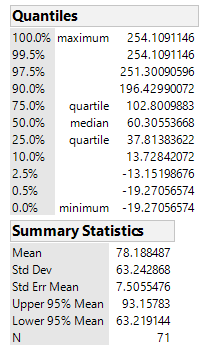
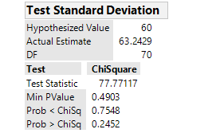
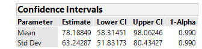

Spencer Retcher
[sretcher.github.io](https://github.com/sretcher/sretcher.github.io)

## One Sample Chi-Squared Test
A study was conducted to learn about the effects of irrelevant speech on memorization (*Acoustical Science and Technology* Vol. 35, 2014). 71 subjects performed a memorization task under two conditions-with irrelevant background speech or silence. For each subject, the RDER (error between the two conditions as a percentage) was recorded. We will be using a one sample chi-squared test to see if the true standard deviation of the RDER measurements differs from 60 percent. We will use a level of significance of .01 for this problem.

### Conditions Required for a Valid Large Sample Hypothesis Test for Population Variance

1. A random sample is selected from the target population.
2. The population is normally distributed.

We will assume that the assumptions have been fulfilled for this problem.

### Formulating Hypotheses

Since the chi-squared test is used primarily for inferences about a population variance, we will need to to write our hypotheses in terms of the population variance. 

Ho: σ^2 = 3600

Ha: σ^2 != 3600

###  χ2 Statistic



The above table gives us the summary statistics of our dataset. If we square the standard deviation, we get our sample variance which is 3999.666. Using the formula χ2=(n−1)s^2/σ^2, our test statistic is equal to 77.7712. Since we are assuming the population is normally distributed and we have a random sample, the sampling distribution of the sample variance and our test statistic will have a chi-square distribution. 

### Test of Hypotheses

Using a rejection region approach, we first must find the critical values of the chi-square distribution corresponding to a df of 70 and a level of signficance of .01. 

We need to find two critical values because we are doing a two-tailed test. Using a table, we find that our critical values are  χ2(.995) = 43.2752 and  χ2(.005) = 104.215. Since 77.7712 > 43.2752 and 77.7712 < 104.215, we do not have enough evidence to reject the null hypothesis.




Using a p-value approach, we see that .01 < .4903, so we do not reject our null hypothesis. Using a table, we see that our test statistic is between χ2(.90) and χ2(.10) for the upper tail. This means that the p-value for σ^2 > 3600 is between .10 and .90. Looking at our table, we see that the p-value for the upper tail test is indeed more than .10. Since this is a two-tail test, we can make the assumption that the p-value is greater than 2(.10) = .20. Looking at the two tailed p-value we see that .4903>.20, which agrees with our assumption. 


### Confidence Interval

Using the formula (n−1)s^2/χ2L<σ2<(n−1)s^2/χ2H, we are 99% confident that the true variance is in the interval (2686.52,6469.6). Taking the sqrt of the interval, we are 99% confident that the true standard deviation of RDER measurements is in the interval (51.8317, 80.4343). Using JMP, we get a similiar answer. 



### Doing the Test in R

```

speech <- read.csv("ISR.csv",header = TRUE)

library(TeachingDemos)

sigma.test(x=speech$RDER,sigma=60,alternative="two.sided",conf.level = 0.99)

### One sample Chi-squared test for variance

### data:  speech$RDER
### X-squared = 77.771, df = 70, p-value = 0.4903
### alternative hypothesis: true variance is not equal to 3600
### 99 percent confidence interval:
### 2686.528 6469.672
### sample estimates:
### var of speech$RDER 
###     3999.66 
```


